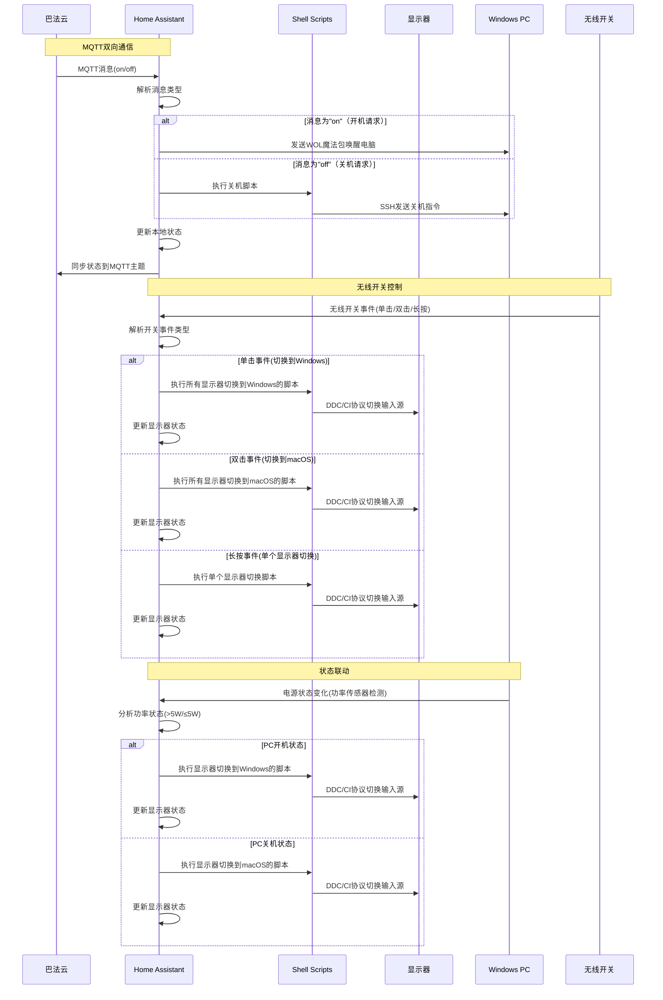

# Home Assistant 项目总结 📋

## 1. 项目概述
这是一个基于 Home Assistant 的个人设备自动化控制项目，实现了显示器输入源切换、远程 PC 开关机等功能，并与**巴法云（BEMFA）** 实现了 MQTT 消息同步。

## 2. 主要功能模块

### 2.1 显示器输入源切换系统
通过 Home Assistant 控制两台显示器在 Windows 和 macOS 系统之间切换

#### 支持的显示器
- **LG ULTRAGEAR**：Screen11.sh/Screen12.sh
- **AG273QG3R3B**：Screen21.sh/Screen22.sh

#### 实现方式
使用 `betterdisplaycli` 工具通过 DDC/CI 协议切换显示器输入源：
```bash
# 切换到 Windows (LG UltraGear)
/opt/homebrew/bin/betterdisplaycli set --namelike="LG ULTRAGEAR" --ddcAlt=208 --vcp=inputSelectAlt

# 切换到 macOS (AG273QG3R3B)
/opt/homebrew/bin/betterdisplaycli set --namelike="AG273QG3R3B" --ddc=15 --vcp=inputSelect
```

### 2.2 远程 PC 开关机系统
通过 SSH 实现 Windows 电脑的远程关机控制，通过 Wake-on-LAN (WOL) 实现远程开机

#### 配置参数
- 远程主机：YOUR_REMOTE_WINDOWS_IP
- 用户名：YOUR_REMOTE_WINDOWS_USERNAME
- 目标设备MAC地址：YOUR_WINDOWS_PC_MAC_ADDRESS（用于WOL开机）

#### 实现方式
```bash
# 远程关机（SSH）
ssh $REMOTE_USER@$REMOTE_HOST "shutdown /s /t 0"

# 远程开机（WOL）
# 通过 Home Assistant 内置的 Wake-on-LAN 功能发送魔法包
# 实体ID：button.wake_on_lan_xxx
```

### 2.3 无线开关控制
通过小米无线开关实现多设备联动控制：
- 单击：切换所有显示器和 KVM 到 Windows
- 双击：切换所有设备到 macOS
- 长按：切换单个显示器输入源

### 2.4 状态监测系统
- **KVM 当前状态**：通过指示灯判断当前系统
- **Windows 电脑状态**：基于功率检测（>5W 判定为开机）

## 3. BEMFA 云平台集成 ✨

### 3.1 集成方案
项目通过 MQTT 协议与巴法云平台实现双向通信

### 3.2 功能实现

#### 3.2.1 消息接收（巴法云 → Home Assistant）
```yaml
- id: '1763024500001'
  alias: "巴法云MQTT消息控制开关机灯"
  triggers:
  - trigger: mqtt
    topic: "YOUR_BEMFA_MQTT_TOPIC"
  actions:
  - service: light.turn_{{ trigger.payload }}
    target:
      entity_id: light.remote_windows_shutdown
```

#### 3.2.2 状态同步（Home Assistant → 巴法云）
```yaml
- id: '1763024500002'
  alias: "开关机灯状态同步到巴法云MQTT"
  triggers:
  - trigger: state
    entity_id:
    - light.remote_windows_shutdown
  actions:
  - service: mqtt.publish
    data:
      topic: "YOUR_BEMFA_MQTT_TOPIC"
      payload: "{{ 'on' if is_state('light.remote_windows_shutdown', 'on') else 'off' }}"
```

### 3.3 工作原理


## 4. 核心文件结构
```
homeassistant-script/
├── configuration.yaml      # 主配置文件
├── automations.yaml        # 自动化规则
├── Screen11.sh            # LG ULTRAGEAR→Windows
├── Screen12.sh            # LG ULTRAGEAR→macOS
├── Screen21.sh            # AG273QG3R3B→Windows
├── Screen22.sh            # AG273QG3R3B→macOS
└── shutdown-remote.sh     # 远程关机脚本
```

## 5. 技术栈
- Home Assistant 核心框架
- MQTT 协议
- Shell 脚本
- betterdisplaycli 工具
- SSH 远程执行
- DDC/CI 显示器控制

## 6. 使用场景
1. 一键切换双显示器输入源
2. 远程控制 PC 开关机
3. 无线开关便捷操作
4. 巴法云远程访问控制

## 7. 隐私化说明
为了保护隐私，项目中的所有敏感信息都已替换为占位符：
- IP地址 → YOUR_MAC_IP / YOUR_REMOTE_WINDOWS_IP
- 用户名 → YOUR_MAC_USERNAME / YOUR_REMOTE_WINDOWS_USERNAME
- 巴法云MQTT主题 → YOUR_BEMFA_MQTT_TOPIC
- MAC地址 → YOUR_WINDOWS_PC_MAC_ADDRESS
- 路径 → /path/to/your/

使用时请将这些占位符替换为实际值。

## 8. 总结
该项目实现了一个完整的个人设备自动化控制系统，通过 Home Assistant 整合了显示器控制、远程 PC 管理和巴法云远程访问功能，提升了设备操作的便捷性和智能化水平。