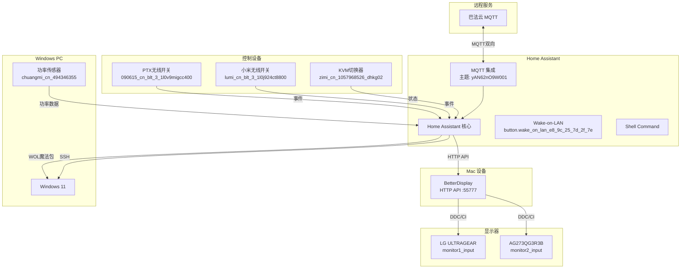
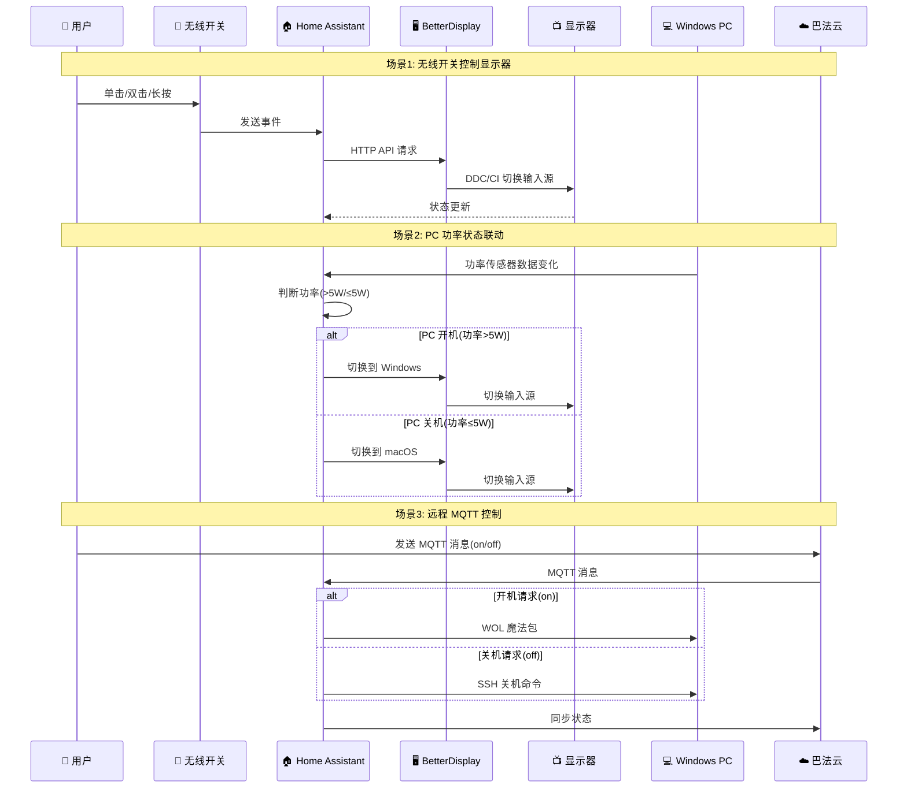

# 🏠 Home Assistant 自动化控制项目

> 基于 Home Assistant 的个人设备自动化控制系统，通过 BetterDisplay HTTP API 实现显示器输入源切换、远程 PC 开关机等功能，并与巴法云实现 MQTT 消息同步。

---

## 📋 目录

- [项目概述](#-项目概述)
- [核心功能](#-核心功能)
- [系统架构](#-系统架构)
- [文件结构](#-文件结构)
- [配置说明](#-配置说明)
- [自动化规则](#-自动化规则)
- [快速开始](#-快速开始)
- [故障排查](#-故障排查)

---

## 🎯 项目概述

本项目通过 Home Assistant 实现了以下自动化功能：

- 🖥️ **双显示器输入源切换**：通过 BetterDisplay HTTP API 控制 LG ULTRAGEAR 和 AG273QG3R3B
- 💻 **远程 PC 开关机**：通过 WOL 和 SSH 控制 Windows 11 PC
- 🔌 **无线开关控制**：PTX 和小米无线开关实现多设备联动
- ☁️ **巴法云 MQTT 集成**：实现远程控制和状态同步
- 📊 **状态监测**：KVM 状态和 Windows PC 功率检测

---

## 🚀 核心功能

### 1. 🖥️ 显示器输入源切换

通过 BetterDisplay HTTP API 控制两台显示器：

#### 显示器配置

| 显示器 | 实体ID | Windows 参数 | macOS 参数 |
|--------|--------|-------------|-----------|
| **LG ULTRAGEAR** | `light.monitor1_input` | `ddcAlt=208` | `ddcAlt=144` |
| **AG273QG3R3B** | `light.monitor2_input` | `ddc=17` | `ddc=15` |

#### HTTP API 调用

```bash
# LG ULTRAGEAR 切换到 Windows
curl -s "http://BETTERDISPLAY_HOST:BETTERDISPLAY_PORT/set?namelike=LG%20ULTRAGEAR&ddcAlt=208&vcp=inputSelectAlt&token=BETTERDISPLAY_TOKEN"

# LG ULTRAGEAR 切换到 macOS
curl -s "http://BETTERDISPLAY_HOST:BETTERDISPLAY_PORT/set?namelike=LG%20ULTRAGEAR&ddcAlt=144&vcp=inputSelectAlt&token=BETTERDISPLAY_TOKEN"

# AG273QG3R3B 切换到 Windows
curl -s "http://BETTERDISPLAY_HOST:BETTERDISPLAY_PORT/set?namelike=AG273QG3R3B&ddc=17&vcp=inputSelect&token=BETTERDISPLAY_TOKEN"

# AG273QG3R3B 切换到 macOS
curl -s "http://BETTERDISPLAY_HOST:BETTERDISPLAY_PORT/set?namelike=AG273QG3R3B&ddc=15&vcp=inputSelect&token=BETTERDISPLAY_TOKEN"
```

### 2. 💻 远程 PC 开关机

#### 开机（WOL）

```yaml
# WOL 按钮实体
button.wake_on_lan_e8_9c_25_7d_2f_7e
```

#### 关机（SSH）

```bash
# 通过 SSH 执行 Windows 关机命令
ssh YOUR_REMOTE_WINDOWS_USERNAME@YOUR_REMOTE_WINDOWS_IP "shutdown /s /t 0"
```

### 3. 🔌 无线开关控制

#### PTX 无线开关 (`event.090615_cn_blt_3_1l0v9migcc400_btsw1`)

| 操作 | 功能 | 自动化ID |
|------|------|----------|
| **单击** | 切换所有显示器和 KVM 到 Windows | `1760714015667` |
| **双击** | 切换所有设备到 macOS | `1760863198332` |
| **长按** | 切换 KVM 状态 | `1762852354876` |

#### 小米无线开关 (`event.lumi_cn_blt_3_1l0j924ct8800_mcn001`)

| 操作 | 功能 | 自动化ID |
|------|------|----------|
| **长按** | 切换 LG 显示器状态 | `1760714307049` |
| **双击** | 切换 AG 显示器状态 | `1760714385388` |
| **长按** | 切换 KVM 状态 | `1760852477188` |

### 4. ☁️ 巴法云 MQTT 集成

#### MQTT 主题

```
yAN62nO9W001
```

#### 自动化规则

- **接收消息** (`1763024500001`)：巴法云 MQTT 消息控制开关机灯
- **状态同步** (`1763024500002`)：开关机灯状态同步到巴法云 MQTT

### 5. 📊 状态监测

#### KVM 状态传感器

```yaml
sensor.kvm_current_state
# 基于 light.zimi_cn_1057968526_dhkg02_s_10_indicator_light 状态
# 'on' = Windows, 'off' = MacOS
```

#### Windows PC 功率检测

```yaml
sensor.windows_pc_power_state
# 基于 sensor.chuangmi_cn_494346355_212a01_electric_power_p_5_6
# 功率 > 5W = On, ≤ 5W = Off
```

#### PC 状态联动

- **PC 开机** (`1763024312770`)：自动触发切换到 Windows 模式
- **PC 关机** (`1763024439637`)：自动触发切换到 macOS 模式

---

## 🏗️ 系统架构

### 整体架构图



### 工作流程



---

## 📁 文件结构

```
HaYmcc/
├── README.md                          # 📖 项目文档（本文件）
└── homeassistant-script/
    ├── configuration.yaml             # ⚙️ 主配置文件
    └── automations.yaml                # 🤖 自动化规则（9个规则）
```

### 文件说明

| 文件 | 说明 | 关键内容 |
|------|------|---------|
| `configuration.yaml` | Home Assistant 主配置 | Shell命令、模板灯光、传感器、输入实体 |
| `automations.yaml` | 自动化规则 | 9个自动化规则，包括无线开关、MQTT、状态联动 |

---

## ⚙️ 配置说明

### 1. Shell Command 配置

```yaml
shell_command:
  # 显示器1 (LG ULTRAGEAR) 切换到 Windows
  switch_monitor1_to_windows:
    command_template: >
      curl -s http://192.168.31.236:55777/set?namelike=LG%20ULTRAGEAR&ddcAlt=208&vcp=inputSelectAlt&token=homeassistant
  
  # 显示器1 (LG ULTRAGEAR) 切换到 macOS
  switch_monitor1_to_macos:
    command_template: >
      curl -s http://192.168.31.236:55777/set?namelike=LG%20ULTRAGEAR&ddcAlt=144&vcp=inputSelectAlt&token=homeassistant
  
  # 显示器2 (AG273QG3R3B) 切换到 Windows
  switch_monitor2_to_windows:
    command_template: >
      curl -s http://192.168.31.236:55777/set?namelike=AG273QG3R3B&ddc=17&vcp=inputSelect&token=homeassistant
  
  # 显示器2 (AG273QG3R3B) 切换到 macOS
  switch_monitor2_to_macos:
    command_template: >
      curl -s http://192.168.31.236:55777/set?namelike=AG273QG3R3B&ddc=15&vcp=inputSelect&token=homeassistant
  
  # 远程关机 Windows
  shutdown_remote_windows: >
    ssh !secret remote_windows_username@!secret remote_windows_ip "shutdown /s /t 0"
```

### 2. 模板灯光实体

#### 显示器输入源控制

```yaml
light:
  - platform: template
    lights:
      # LG 显示器 (monitor1_input)
      monitor1_input: 
        friendly_name: "LG显示器"
        unique_id: "template_light_monitor1_input"
        value_template: "{{ states('input_text.monitor1_state') == 'windows' }}"
        turn_on:
          - service: shell_command.switch_monitor1_to_windows
          - service: input_text.set_value
            target:
              entity_id: input_text.monitor1_state
            data:
              value: 'windows'
        turn_off:
          - service: shell_command.switch_monitor1_to_macos
          - service: input_text.set_value
            target:
              entity_id: input_text.monitor1_state
            data:
              value: 'macos'
      
      # AG 显示器 (monitor2_input)
      monitor2_input: 
        friendly_name: "AG显示器"
        unique_id: "template_light_monitor2_input"
        value_template: "{{ states('input_text.monitor2_state') == 'windows' }}"
        # ... 类似配置 ...
      
      # Windows PC 开关机控制 (windows11_power)
      windows11_power: 
        friendly_name: "Windows11"
        unique_id: "template_light_windows11_power"
        value_template: "{{ states('input_boolean.remote_shutdown_switch') }}"
        turn_on:
          - service: button.press
            target:
              entity_id: button.wake_on_lan_e8_9c_25_7d_2f_7e
          - service: input_boolean.turn_on
            target:
              entity_id: input_boolean.remote_shutdown_switch
        turn_off:
          - service: shell_command.shutdown_remote_windows
          - service: input_boolean.turn_off
            target:
              entity_id: input_boolean.remote_shutdown_switch
        icon_template: "mdi:power"
```

### 3. 传感器配置

```yaml
sensor:
  - platform: template
    sensors:
      # KVM 状态传感器
      kvm_current_state:
        friendly_name: "KVM当前状态"
        unique_id: "template_sensor_kvm_current_state"
        value_template: >
          {{ 'Windows' if is_state('light.zimi_cn_1057968526_dhkg02_s_10_indicator_light', 'on') else 'MacOS' }}
        icon_template: "mdi:switch"
      
      # Windows PC 功率检测传感器
      windows_pc_power_state:
        friendly_name: "Windows电脑状态（功率检测）"
        unique_id: "template_sensor_windows_pc_power_state"
        value_template: >
          {{ 'On' if (states('sensor.chuangmi_cn_494346355_212a01_electric_power_p_5_6') | float(0) > 5.0) else 'Off' }}
        icon_template: >
          {{ 'mdi:laptop-on' if is_state('sensor.windows_pc_power_state', 'On') else 'mdi:laptop-off' }}
```

### 4. 输入实体配置

```yaml
input_text:
  monitor1_state:
    name: LG显示器 State
    initial: 'macos'
    max: 10
  
  monitor2_state:
    name: AG显示器 State
    initial: 'macos'
    max: 10

input_boolean:
  remote_shutdown_switch:
    name: "Windows远程关机开关"
    initial: off
```

---

## 🤖 自动化规则

### 自动化规则列表

| ID | 别名 | 触发器 | 动作 |
|----|------|--------|------|
| `1760714015667` | 单击PTX无线开关-切换显示器输入源以及KVM输入源 | PTX单击事件 | 打开所有显示器和KVM |
| `1760714307049` | 小米无线开关长按，lg显示器切换状态 | 小米长按事件 | 切换LG显示器状态 |
| `1760714385388` | 小米无线开关双击，切换ag显示器状态 | 小米双击事件 | 切换AG显示器状态 |
| `1760852477188` | 小米无线开关控制KVM | 小米长按事件 | 切换KVM状态 |
| `1760863198332` | 双击切换到mac模式 | PTX双击事件 | 关闭所有显示器和KVM |
| `1762852354876` | 新建自动化 | PTX长按事件 | 切换KVM状态 |
| `1763024312770` | 当 Windows电脑状态从关闭变为开启 | PC功率状态变化(Off→On) | 触发切换到Windows模式 |
| `1763024439637` | 当 Windows电脑状态从开启变为关闭 | PC功率状态变化(On→Off) | 触发切换到macOS模式 |
| `1763024500001` | 巴法云MQTT消息控制开关机灯 | MQTT消息 | 控制Windows PC开关机 |
| `1763024500002` | 开关机灯状态同步到巴法云MQTT | Windows PC状态变化 | 同步状态到MQTT |

### 关键自动化规则详解

#### 1. PTX 无线开关单击 - 切换到 Windows

```yaml
- id: '1760714015667'
  alias: 单击PTX无线开关-切换显示器输入源以及KVM输入源
  triggers:
  - trigger: state
    entity_id:
    - event.090615_cn_blt_3_1l0v9migcc400_btsw1_click_e_2_1012
  actions:
  - action: light.turn_on
    target:
      entity_id:
      - light.zimi_cn_1057968526_dhkg02_s_10_indicator_light  # KVM
      - light.monitor2_input  # AG显示器
      - light.monitor1_input   # LG显示器
```

#### 2. PC 状态联动 - 开机自动切换

```yaml
- id: '1763024312770'
  alias: 当 Windows电脑状态（功率检测） 从 关闭 变为 开启，单击ptx，显示器切换至Windows模式
  triggers:
    - trigger: state
      entity_id:
      - sensor.windows_pc_power_state
      from:
      - 'Off'
      to:
      - 'On'
  actions:
  - action: automation.trigger
    target:
      entity_id: automation.00  # 触发切换到Windows的自动化
```

#### 3. 巴法云 MQTT 控制

```yaml
- id: '1763024500001'
  alias: 巴法云MQTT消息控制开关机灯
  triggers:
  - trigger: mqtt
    topic: yAN62nO9W001
  actions:
  - service: light.turn_{{ trigger.payload }}  # on 或 off
    target:
      entity_id: light.windows11_power
```

---

## 🚀 快速开始

### 📋 前置条件

- ✅ Home Assistant 已安装
- ✅ Mac 电脑已安装 BetterDisplay 应用
- ✅ Windows 11 PC 已开启 SSH 和 WOL
- ✅ 两台支持 DDC/CI 的显示器
- ✅ 巴法云账号（用于 MQTT）

### 🔧 配置步骤

#### 1. 启用 BetterDisplay HTTP 集成

1. 打开 BetterDisplay 应用
2. Settings → Application → Integration
3. ✅ 启用 HTTP integration
4. 📝 记录端口号（默认：`55777`）

#### 2. 修改配置文件

编辑 `configuration.yaml`，替换占位符：

```yaml
# 必需配置
BETTERDISPLAY_HOST: "192.168.31.236"        # 或 Mac 的局域网 IP
BETTERDISPLAY_PORT: "55777"            # BetterDisplay HTTP 端口

# Windows PC 配置
YOUR_REMOTE_WINDOWS_IP: "192.168.1.100"
YOUR_REMOTE_WINDOWS_USERNAME: "your_username"

# 反向代理（如果使用）
YOUR_REVERSE_PROXY_IP: "192.168.1.1"
```

编辑 `automations.yaml`，确认 MQTT 主题：

```yaml
# MQTT 主题（当前配置）
topic: yAN62nO9W001
```

> **注意**：Windows PC 远程关机配置在 `configuration.yaml` 的 `shell_command.shutdown_remote_windows` 中，直接使用 SSH 命令，无需额外脚本文件。

#### 3. 配置 Home Assistant 集成

##### MQTT 集成

1. 配置 → 设备与服务 → + 添加集成
2. 搜索「MQTT」并安装
3. 配置信息：
   ```
   服务器：bemfa.com
   端口：8344
   用户名：你的巴法云用户名
   密码：你的巴法云密码
   ```

##### Wake on LAN 集成

1. 添加集成 → 搜索「Wake on LAN」
2. 填写 Windows PC 的 MAC 地址
3. 📝 确认实体 ID：`button.wake_on_lan_e8_9c_25_7d_2f_7e`

#### 4. 重启 Home Assistant

配置 → 服务器控制 → 重启

---

## 🔍 故障排查

### ❌ HTTP API 请求失败

**测试命令：**
```bash
curl "http://192.168.31.236:55777/set?namelike=LG%20ULTRAGEAR&ddcAlt=208&vcp=inputSelectAlt"
```

**解决方法：**
- 检查 BetterDisplay HTTP 集成是否启用
- 确认端口号是否正确（默认 55777）
- 检查 Mac 防火墙设置

### ❌ 显示器未切换

**解决方法：**
```bash
# 查看显示器名称
betterdisplaycli list

# 检查 DDC/CI 是否启用
# 在显示器设置中确认 DDC/CI 选项已开启
```

### ❌ SSH 连接失败

**测试命令：**
```bash
ssh YOUR_REMOTE_WINDOWS_USERNAME@YOUR_REMOTE_WINDOWS_IP
```

**解决方法：**
- 检查 Windows SSH 服务是否运行
- 确认防火墙允许 SSH 端口（22）
- 验证用户名和 IP 地址

### ❌ WOL 无法唤醒 PC

**解决方法：**
- 检查 BIOS/UEFI 中的 WOL 设置
- 检查网卡属性中的「唤醒魔包」选项
- 确保 Home Assistant 与 PC 在同一局域网

### ❌ MQTT 连接失败

**解决方法：**
- 检查 MQTT 服务器配置：`bemfa.com:8344`
- 确认巴法云账号的用户名和密码
- 检查网络连接

---

## 📚 参考资源

- [BetterDisplay 集成文档](https://github.com/waydabber/BetterDisplay/wiki/Integration-features,-CLI)
- [Home Assistant 官方文档](https://www.home-assistant.io/docs/)
- [巴法云 MQTT 文档](https://bemfa.com/docs/)

---

## 🔒 隐私说明

项目中的敏感信息已替换为占位符，使用时请替换为实际值：

| 占位符 | 说明 |
|--------|------|
| `BETTERDISPLAY_HOST` | BetterDisplay 主机地址 |
| `BETTERDISPLAY_PORT` | BetterDisplay HTTP 端口 |
| `YOUR_REMOTE_WINDOWS_IP` | Windows PC IP 地址 |
| `YOUR_REMOTE_WINDOWS_USERNAME` | Windows 用户名 |
| `YOUR_REVERSE_PROXY_IP` | 反向代理 IP（如果使用） |

---

## 📝 实体列表

### 灯光实体

- `light.monitor1_input` - LG 显示器输入源
- `light.monitor2_input` - AG 显示器输入源
- `light.windows11_power` - Windows PC 开关机
- `light.zimi_cn_1057968526_dhkg02_s_10_indicator_light` - KVM 指示灯

### 传感器实体

- `sensor.kvm_current_state` - KVM 当前状态
- `sensor.windows_pc_power_state` - Windows PC 功率状态
- `sensor.chuangmi_cn_494346355_212a01_electric_power_p_5_6` - 功率传感器

### 按钮实体

- `button.wake_on_lan_e8_9c_25_7d_2f_7e` - WOL 唤醒按钮

### 输入实体

- `input_text.monitor1_state` - LG 显示器状态
- `input_text.monitor2_state` - AG 显示器状态
- `input_boolean.remote_shutdown_switch` - Windows 远程关机开关

---

**版本**：v2.0  
**更新日期**：2024-01-XX
