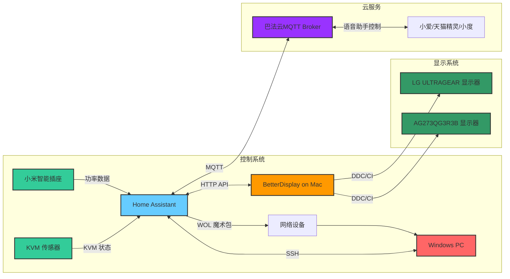

# 🖥️ Home Assistant 显示器与PC控制集成方案

> 💡 一个基于Home Assistant的智能显示器与PC控制解决方案，通过BetterDisplay API实现显示器输入源无缝切换，通过SSH实现Windows远程关机，为您打造高效便捷的多设备工作环境。

## 🚀 快速开始

### 1. 核心组件安装
```bash
# 1. 安装BetterDisplay (Mac端)
# 官方地址：https://betterdisplay.pro/

# 2. 配置Home Assistant
cp homeassistant-script/* /path/to/homeassistant/config/
```

### 2. 关键配置步骤
1. 📺 在Mac上启用BetterDisplay HTTP API
2. 🎯 在HA中配置BetterDisplay连接参数
3. 🔑 配置SSH免密登录到Windows PC
4. ⏯️ 设置WOL唤醒功能

---

## 🎯 项目背景

在多设备工作环境中，频繁手动切换显示器输入源和控制PC开关机是一件繁琐的事情。本方案旨在通过Home Assistant整合BetterDisplay和SSH技术，实现显示器输入源自动/手动切换和PC远程控制，提升工作效率和用户体验。

## ✨ 核心优势

- 🔄 **无缝切换**：在Windows和macOS之间一键切换显示器输入源
- 🎮 **集中控制**：通过Home Assistant统一管理所有设备
- 💤 **远程管理**：支持Windows远程关机和唤醒
- 📊 **状态监控**：实时显示设备状态
- ⚙️ **高度自定义**：支持根据需求调整配置

## 🏗️ 系统架构



## ⚙️ 工作原理图

```mermaid
sequenceDiagram 
    participant BEMFA as 巴法云
    participant HA as Home Assistant
    participant BetterDisplay as BetterDisplay
    participant SSH as SSH Client
    participant Monitor1 as LG显示器
    participant Monitor2 as AG显示器
    participant PC as Windows PC
    participant Switch1 as PTX无线开关
    participant Switch2 as 小米无线开关
    participant Sensor as 功率传感器
    participant KVM as KVM设备

    Note over BEMFA, HA: MQTT双向通信 - 开关机控制
    BEMFA->>HA: MQTT消息(on/off) 到主题 yAN62nO9W001
    HA->>HA: 解析消息类型
    alt 消息为"on"（开机请求）
        HA->>PC: 发送WOL魔法包唤醒电脑
    else 消息为"off"（关机请求）
        HA->>SSH: 执行关机脚本
        SSH->>PC: SSH发送关机指令 "shutdown /s /t 5"
    end
    HA->>HA: 更新输入布尔值 remote_shutdown_switch
    HA->>BEMFA: 同步 light.windows11_power 状态到MQTT主题

    Note over Switch1, Switch2, HA: 无线开关控制 - 显示器输入源切换
    par PTX无线开关事件
        Switch1->>HA: 单击事件
        HA->>BetterDisplay: 调用BetterDisplay API切换所有显示器到Windows
        BetterDisplay->>Monitor1: DDC/CI协议切换到Windows (输入源15)
        BetterDisplay->>Monitor2: DDC/CI协议切换到Windows (输入源17)
        HA->>HA: 更新 input_text.monitor1_state 为 "windows"
        HA->>HA: 更新 input_text.monitor2_state 为 "windows"
    and 小米无线开关事件
        Switch2->>HA: 长按事件
        HA->>BetterDisplay: 调用BetterDisplay API切换到macOS
        BetterDisplay->>Monitor1: DDC/CI协议切换到macOS (输入源17)
        BetterDisplay->>Monitor2: DDC/CI协议切换到macOS (输入源15)
        HA->>HA: 更新 input_text.monitor1_state 为 "macos"
        HA->>HA: 更新 input_text.monitor2_state 为 "macos"
    end

    Note over PC, Sensor, HA: 状态联动 - 自动切换
    Sensor->>HA: 检测Windows PC功率变化
    HA->>HA: 更新 sensor.windows_pc_power_state (功率>5W为On)
    alt Windows PC从Off到On
        HA->>BetterDisplay: 自动切换所有显示器到Windows
        BetterDisplay->>Monitor1: DDC/CI协议切换到Windows
        BetterDisplay->>Monitor2: DDC/CI协议切换到Windows
        HA->>HA: 更新显示器状态
    else Windows PC从On到Off
        HA->>BetterDisplay: 自动切换所有显示器到macOS
        BetterDisplay->>Monitor1: DDC/CI协议切换到macOS
        BetterDisplay->>Monitor2: DDC/CI协议切换到macOS
        HA->>HA: 更新显示器状态
    end

    Note over HA, KVM: 状态同步 - KVM与显示器状态
    HA->>HA: 检查KVM指示灯状态
    HA->>HA: 更新 sensor.kvm_current_state (指示灯亮为Windows)
    HA->>HA: 确保显示器状态与KVM一致
```

## 📋 功能概述

本方案提供三大核心功能：
1. **显示器输入源切换**：通过BetterDisplay API在Windows和macOS之间切换显示器输入源
2. **远程开关机功能**：通过SSH实现Windows远程关机，通过WOL实现远程唤醒
3. **智能音箱控制**：通过巴法云MQTT实现小爱同学/天猫精灵/小度音箱语音控制

---

## 🎮 功能一：显示器输入源切换

### 🚀 部署步骤

#### 1. BetterDisplay配置（Mac端）

```bash
# 1. 下载并安装BetterDisplay
# 官方地址：https://betterdisplay.pro/

# 2. 启用HTTP集成功能
# 打开BetterDisplay → 设置 → 应用 → 集成
# 启用「HTTP 集成」和「控制集成」

# 3. 配置HTTP服务
# - 设置HTTP服务监听端口（默认：55777）
# - 配置API访问令牌（可选但推荐，用于安全访问）

# 4. 验证API可用性
# 测试调节显示器亮度到80%（MyDisplay为您的显示器名称）
# 如果执行成功，显示器亮度会立即变化
curl http://localhost:55777/set?name=MyDisplay&brightness=0.8

# 或者使用带令牌的验证命令（如果已配置API令牌）
curl http://localhost:55777/set?name=MyDisplay&brightness=0.8&token=YOUR_API_TOKEN
```

#### 2. Home Assistant配置

```bash
# 将配置文件复制到Home Assistant配置目录
cp homeassistant-script/* /path/to/homeassistant/config/

# 编辑configuration.yaml，替换占位符为实际值
nano /path/to/homeassistant/config/configuration.yaml

# 重新加载Home Assistant配置
# 在Home Assistant界面 → 配置 → 服务器控制 → 重新加载
```

### 💡 实现方法

#### 1. API调用原理
通过BetterDisplay官方HTTP API发送DDC/CI命令实现输入源切换和显示器控制。

##### 📌 name vs namelike参数区别
API支持两种方式指定显示器：

| 参数 | 匹配方式 | 特点 | 适用场景 |
|------|----------|------|----------|
| **`name`** | 精确匹配 | 区分大小写，完全匹配显示器名称 | 已知显示器确切名称且唯一时使用，性能最佳 |
| **`namelike`** | 模糊匹配 | 不区分大小写，支持部分匹配 | 显示器名称较长、不确定完整名称或需要批量匹配时使用 |

**示例说明：**
- 显示器完整名称：`LG ULTRAGEAR 27GP850`
  - 精确匹配：`name=LG%20ULTRAGEAR%2027GP850` ✅
  - 模糊匹配：`namelike=ultragear` ✅（不区分大小写）
  - 模糊匹配：`namelike=27GP850` ✅（部分匹配）
  - 模糊匹配：`namelike=gp850` ✅（不区分大小写，部分匹配）

- 显示器完整名称：`Samsung Odyssey G7`
  - 精确匹配：`name=Samsung%20Odyssey%20G7` ✅
  - 模糊匹配：`namelike=odyssey` ✅（不区分大小写）
  - 模糊匹配：`namelike=g7` ✅（部分匹配）

通过BetterDisplay官方HTTP API发送DDC/CI命令实现输入源切换：

```yaml
# LG ULTRAGEAR切换到Windows (使用DDC Alt命令)
# 注意：请将以下参数替换为您的实际配置
curl -s http://192.168.1.100:12345/set?namelike=LG%20ULTRAGEAR%2027GP850&ddcAlt=15&vcp=inputSelectAlt&token=abcdef123456

# AG273QG3R3B切换到macOS (使用标准DDC命令)
# 注意：请将以下参数替换为您的实际配置
curl -s http://192.168.1.100:12345/set?namelike=AG273QG3R3B&ddc=17&vcp=inputSelect&token=abcdef123456

# 调节显示器亮度到80% (brightness范围: 0-1，0=最暗，1=最亮)
# 使用模糊匹配namelike参数 (适用于不确定完整名称或名称较长的情况)
# 注意：请将以下参数替换为您的实际配置
curl -s http://192.168.1.100:12345/set?namelike=MyDisplay&brightness=0.8&token=abcdef123456

# 使用精确匹配name参数 (适用于已知确切名称且名称唯一的情况)
# 注意：请将以下参数替换为您的实际配置
curl -s http://192.168.1.100:12345/set?name=MyDisplay&brightness=0.8&token=abcdef123456

# 调节显示器对比度到50% (contrast范围: 0-1，0=最低，1=最高)
# 注意：请将以下参数替换为您的实际配置
curl -s http://192.168.1.100:12345/set?namelike=MyDisplay&contrast=0.5&token=abcdef123456

# 调节显示器音量到20% (volume范围: 0-1，0=静音，1=最大，部分显示器不支持)
# 注意：请将以下参数替换为您的实际配置
curl -s http://192.168.1.100:12345/set?namelike=MyDisplay&volume=0.2&token=abcdef123456

# 示例：使用精确匹配name参数调节亮度 (适合名称唯一的显示器)
curl -s http://192.168.1.100:12345/set?name=My%20Display%2027&brightness=0.6&token=abcdef123456

# 示例：使用模糊匹配namelike参数调节对比度 (适合名称较长或不确定完整名称的显示器)
curl -s http://192.168.1.100:12345/set?namelike=27&contrast=0.7&token=abcdef123456
```

### 📝 配置参数

#### 1. API参数替换规则
在实际使用API调用时，您需要将以下参数替换为您的真实配置：

| 参数名 | 说明 | 示例值 |
|-------|------|--------|
| `192.168.1.100` | BetterDisplay运行的macOS设备IP地址 | 您的macOS设备IP |
| `12345` | BetterDisplay的HTTP服务端口 | 您在BetterDisplay中设置的端口 |
| `name=My%20Display%2027` | 精确匹配显示器名称（区分大小写） | 使用`urlencode`处理完整显示器名称 |
| `namelike=27` | 模糊匹配显示器名称（不区分大小写） | 使用`urlencode`处理部分显示器名称 |
| `LG%20ULTRAGEAR%2027GP850` / `MyDisplay` | 显示器名称的URL编码 | 使用`urlencode`处理您的显示器名称 |
| `15` / `17` | 显示器输入源的DDC码 | 参考显示器说明书或BetterDisplay中的值 |
| `0.8` | 亮度值（范围0-1，0=最暗，1=最亮） | 0.5（50%亮度） |
| `0.5` | 对比度值（范围0-1，0=最低，1=最高） | 0.7（70%对比度） |
| `0.2` | 音量值（范围0-1，0=静音，1=最大，部分显示器不支持） | 0.5（50%音量） |
| `abcdef123456` | BetterDisplay的API令牌 | 您在BetterDisplay中生成的API令牌 |

#### 2. Home Assistant配置变量
在`configuration.yaml`文件中配置以下全局变量：

```yaml
# BetterDisplay 配置
betterdisplay_host: localhost      # BetterDisplay运行的Mac主机地址
betterdisplay_port: 55777         # BetterDisplay HTTP服务端口
betterdisplay_token: "homeassistant"  # BetterDisplay API安全令牌

# 显示器1配置 (LG ULTRAGEAR)
monitor1_name: "LG ULTRAGEAR"  # 显示器名称（需与BetterDisplay中一致）
monitor1_windows_input: 208     # DDC Alt值 for Windows输入源
monitor1_macos_input: 144       # DDC Alt值 for macOS输入源

# 显示器2配置 (AG273QG3R3B)
monitor2_name: "AG273QG3R3B"    # 显示器名称（需与BetterDisplay中一致）
monitor2_windows_input: 17       # DDC值 for Windows输入源
monitor2_macos_input: 15         # DDC值 for macOS输入源
```

#### 3. 模板开关设计
将显示器切换功能封装为Home Assistant模板开关：

```yaml
light:
  - platform: template
    lights:
      monitor1_input:
        friendly_name: "LG显示器输入源"
        turn_on: {
          service: shell_command.switch_monitor1_to_windows
        }
        turn_off: {
          service: shell_command.switch_monitor1_to_macos
        }
        state: {
          value_template: "{{ states('input_text.monitor1_state') == 'windows' }}"
        }
```

#### 4. 状态存储机制
使用input_text实体存储显示器当前输入源状态：

```yaml
input_text:
  monitor1_state:
    name: LG显示器 State
    initial: 'macos'  # 初始状态
    max: 10
  monitor2_state:
    name: AG显示器 State
    initial: 'macos'  # 初始状态
    max: 10
```

---

## 🖱️ 功能二：远程开关机功能

### 🚀 部署步骤

#### 1. Windows SSH配置

```bash
# 1. 启用OpenSSH服务器
# 设置 → 应用 → 可选功能 → 添加功能 → OpenSSH服务器

# 2. 启动并设置自动运行SSH服务
net start sshd
sc config sshd start=auto

# 3. 配置防火墙规则
netsh advfirewall firewall add rule name=sshd dir=in action=allow protocol=TCP localport=22
```

#### 2. WOL配置（Windows端）

```bash
# 1. 在BIOS中启用WOL功能
# 进入BIOS → 电源管理 → 启用「Wake-on-LAN」或「网络唤醒」

# 2. 在网络适配器设置中启用
# 控制面板 → 网络和Internet → 网络连接 → 右键点击网卡 → 属性
# 点击「配置」→ 电源管理 → 勾选「允许此设备唤醒计算机」和「只允许魔术包唤醒」
```

#### 3. Home Assistant配置

```bash
# 配置WOL按钮
# 在configuration.yaml中添加：
button:
  - platform: wake_on_lan
    name: "Wake Windows PC"
    mac: "e8:9c:25:7d:2f:7e"  # Windows PC的MAC地址
    host: "192.168.31.10"       # Windows PC的IP地址

# 重新加载配置
```

### 💡 实现方法

#### 1. 远程关机实现
远程关机依赖SSH免密登录，**必须先配置HA公钥到Windows PC**，否则会提示密码输入导致命令失败！

##### 1.1 配置SSH公钥（关键步骤）🔑

**步骤1：在HA上生成SSH密钥对**
```bash
# 登录HA终端，执行以下命令生成密钥对（一路回车默认配置即可）
ssh-keygen -t rsa -b 2048
# 输出提示：Generating public/private rsa key pair...（表示生成成功）
```

**步骤2：查看HA的公钥内容**
```bash
# 生成后，查看公钥内容（需复制完整输出，包括ssh-rsa开头的全部内容）
curl -X GET http://localhost:8123/api/hassio_ssh/key
# 示例输出：ssh-rsa AAAAB3NzaC1yc2EAAAADAQABAAABAQD3... root@homeassistant
```

**步骤3：将公钥配置到Windows PC**
```bash
# 1. 登录Windows PC，打开CMD终端
# 2. 创建.ssh目录（若已存在则跳过）
mkdir %USERPROFILE%\.ssh

# 3. 创建authorized_keys文件并粘贴HA公钥
notepad %USERPROFILE%\.ssh\authorized_keys
# ✅ 注意事项：
# - 确保公钥是单行完整内容，没有换行
# - 不要添加任何额外的空格或注释
# 粘贴完成后保存关闭

# 4. 设置文件权限（必须用PowerShell执行，否则免密登录会失败！）
icacls %USERPROFILE%\.ssh /inheritance:r
icacls %USERPROFILE%\.ssh /grant:r "%USERNAME%:F"
icacls %USERPROFILE%\.ssh\authorized_keys /grant:r "%USERNAME%:F"
# ✅ 权限设置说明：
# - /inheritance:r：移除继承的权限
# - /grant:r "%USERNAME%:F"：仅给予当前用户完全控制权限
```

**步骤4：测试SSH连接（验证配置）**
```bash
# 在HA终端执行以下命令测试连接（替换为实际参数）
ssh username@192.168.1.101 "echo '✅ Connection Test Successful!'"
# ✅ 成功：输出"Connection Test Successful!"
# ❌ 失败：提示输入密码（请检查公钥是否正确配置或权限是否设置正确）
```

**🔧 故障排除提示**
1. **权限问题**：确保authorized_keys文件只有当前用户有访问权限
2. **公钥格式**：确保公钥是完整的单行内容，没有换行或额外字符
3. **IP地址/用户名**：确保使用正确的Windows PC IP地址和用户名
4. **SSH服务**：确保Windows PC上的SSH服务正在运行（net start sshd）

##### 1.2 配置HA远程关机命令
公钥配置完成后，在HA的`configuration.yaml`中添加关机命令：

```yaml
# 远程关机命令配置
shell_command:
  shutdown_remote_windows: >
    # 注意：请将以下参数替换为您的实际配置
    ssh username@192.168.1.101 "shutdown /s /t 5"
```

### 📝 SSH命令替换规则
在实际使用中，您需要将以下参数替换为您的真实配置：

| 参数名 | 说明 | 示例值 |
|-------|------|--------|
| `username` | Windows PC的用户名 | 您的Windows用户名 |
| `192.168.1.101` | Windows PC的IP地址 | 您的Windows设备IP |

#### 2. 模板开关设计
将开关机功能封装为Home Assistant模板开关：

```yaml
light:
  - platform: template
    lights:
      windows11_power:
        friendly_name: "Windows PC开关机"
        turn_on: {
          service: button.press
          target: {
            entity_id: button.wake_on_lan_e8_9c_25_7d_2f_7e
          }
        }
        turn_off: {
          service: shell_command.shutdown_remote_windows
        }
        state: {
          value_template: "{{ states('sensor.windows_pc_power_state') == 'on' }}"
        }
```

#### 3. 状态检测机制
通过功率传感器检测Windows PC的开机状态：

```yaml
sensor:
  - platform: template
    sensors:
      windows_pc_power_state:
        friendly_name: "Windows电脑状态（功率检测）"
        value_template: >-                      on                      off          
```

### ⚙️ 需要修改的变量

在`configuration.yaml`文件中配置以下全局变量：

```yaml
# 远程Windows配置
remote_windows_user: "11040"     # Windows PC的用户名
remote_windows_ip: "192.168.31.10"  # Windows PC的IP地址
```

---

## 📁 文件结构

```
HaYmcc/
├── .gitignore                  # Git忽略文件
├── README.md                  # 项目说明文档
└── homeassistant-script/      # Home Assistant配置文件目录
    ├── automations.yaml       # 自动化脚本配置
    ├── configuration.yaml     # 主配置文件
    └── scenes.yaml            # 场景配置文件
```

---

## 🗣️ 功能三：巴法云智能音箱控制

### 💡 功能介绍
通过巴法云服务实现智能音箱（小爱同学、天猫精灵、小度）对Home Assistant设备的语音控制，主要支持：
- 🎙️ 语音控制Windows PC开关机
- 📺 语音控制显示器输入源切换
- 🔄 状态实时同步到智能音箱

### 🚀 部署步骤

#### 1. 巴法云账号配置

```bash
# 1. 注册巴法云账号
# 官方地址：https://www.bemfa.com/

# 2. 获取UID
# 登录后在首页即可看到您的唯一UID

# 3. 创建MQTT主题
# 进入「MQTT物联网平台」→「主题列表」→「新增主题」
# 主题名称建议使用：yAN62nO9W001（需与现有配置一致）
# 选择主题类型为「设备控制」
```

#### 2. Home Assistant MQTT配置

在`configuration.yaml`中添加巴法云MQTT broker配置：

```yaml
# 巴法云MQTT配置
mqtt:
  broker: mqtt.bemfa.com  # 巴法云MQTT服务器地址
  port: 1883              # MQTT端口，默认1883
  client_id: YOUR_UID     # 您的巴法云UID
  username: YOUR_UID      # 用户名与UID一致
  password: YOUR_UID      # 密码与UID一致
```

#### 3. 智能音箱平台配置

- **小爱同学**：在米家APP中添加「巴法云」技能，完成授权后即可发现设备
- **天猫精灵**：在天猫精灵APP中添加「巴法云」技能，完成授权后即可发现设备
- **小度音箱**：在小度APP中添加「巴法云」技能，完成授权后即可发现设备

### 💡 实现方法

#### 1. MQTT通信原理
通过巴法云MQTT主题实现双向通信：
- 智能音箱 → 巴法云MQTT → Home Assistant：语音指令控制
- Home Assistant → 巴法云MQTT → 智能音箱：状态同步

#### 2. 现有自动化实现

在`automations.yaml`中已配置两个巴法云相关自动化：

```yaml
# 巴法云MQTT消息控制开关机灯
- id: '1763024500001'
  alias: 巴法云MQTT消息控制开关机灯
  description: 接收巴法云MQTT消息控制开关机灯
  triggers:
  - trigger: mqtt
    topic: yAN62nO9W001  # 巴法云MQTT主题
  conditions: []
  actions:
  - service: light.turn_{{ trigger.payload }}
    target:
      entity_id: light.windows11_power
  mode: single

# 开关机灯状态同步到巴法云MQTT
- id: '1763024500002'
  alias: 开关机灯状态同步到巴法云MQTT
  description: 将开关机灯状态同步到巴法云MQTT主题
  triggers:
  - trigger: state
    entity_id:
    - light.windows11_power
  conditions: []
  actions:
  - service: mqtt.publish
    data:
      topic: yAN62nO9W001  # 巴法云MQTT主题
      payload: '{{ ''on'' if is_state(''light.windows11_power'', ''on'') else ''off'' }}
  mode: single
```

#### 3. 自定义扩展

如需添加更多设备支持语音控制，只需：
1. 在巴法云平台创建新的MQTT主题
2. 在`automations.yaml`中添加对应的MQTT消息处理自动化
3. 在智能音箱APP中完成设备绑定

### ⚙️ 配置参数替换规则

| 参数名 | 说明 | 示例值 |
|-------|------|--------|
| `YOUR_UID` | 巴法云账号UID | 1234567890 |
| `yAN62nO9W001` | 巴法云MQTT主题 | 自定义主题名称 |

## 🚩 注意事项

1. ⚠️ **BetterDisplay版本要求**：需使用v3.5.3+版本以支持HTTP API，v4.0.4+提供完整功能
2. 💳 **Pro版本要求**：部分高级DDC/CI功能可能需要BetterDisplay Pro许可证
3. 🔑 **API令牌安全**：不要将API令牌暴露在公共代码或配置文件中
4. 📱 **网络连接**：确保Home Assistant可以访问BetterDisplay服务器（Mac）和Windows PC
5. ⏱️ **SSH超时**：如果Windows PC关机，SSH命令会超时
6. 💡 **输入源值**：不同显示器的DDC/CI输入源值可能不同，需自行测试获取
7. 🔍 **名称匹配**：使用`namelike`参数时，确保名称匹配准确

## 📊 测试步骤

### 1. 显示器输入源切换测试
```bash
# 测试API调用
curl http://your-mac-ip:55777/set?namelike=LG%20ULTRAGEAR&ddcAlt=208&vcp=inputSelectAlt&token=your-token

# 在Home Assistant开发者工具中调用
# 开发者工具 → 服务 → 选择shell_command.switch_monitor1_to_windows
```

### 2. 远程开关机测试
```bash
# 测试SSH连接
ssh remote_windows_user@remote_windows_ip

# 测试远程关机
ssh remote_windows_user@remote_windows_ip "shutdown /s /t 1"

# 测试WOL唤醒
curl -X POST http://homeassistant-ip:8123/api/services/button/press -H "Authorization: Bearer your-token" -H "Content-Type: application/json" -d '{"entity_id": "button.wake_windows_pc"}'
```

## 🔧 常见问题排除

**Q: BetterDisplay API无响应**
- A: 检查BetterDisplay是否正在运行，HTTP集成是否启用
- A: 检查Mac防火墙是否允许端口55777的访问

**Q: 显示器切换无反应**
- A: 检查显示器名称是否正确匹配
- A: 检查DDC/CI命令值是否正确
- A: 确保显示器支持DDC/CI功能

**Q: 远程关机失败**
- A: 检查Windows SSH服务是否启用
- A: 检查Home Assistant是否可以连接到Windows PC

**Q: WOL无法唤醒PC**
- A: 检查BIOS中是否启用WOL
- A: 检查网络适配器设置是否正确
- A: 确保MAC地址和IP地址配置正确

---

**更新时间**：2024年1月
**版本**：1.1.0
**许可证**：MIT License